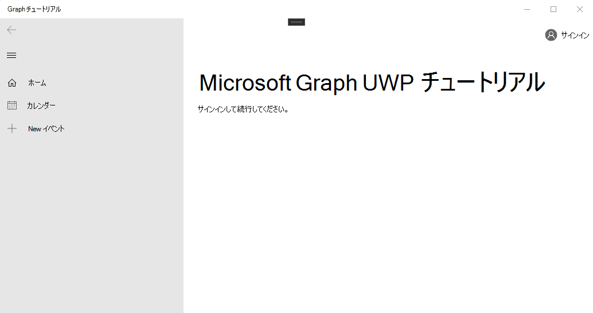

<!-- markdownlint-disable MD002 MD041 -->

<span data-ttu-id="796ad-101">Visual Studio を開き、[**新しいプロジェクトの作成**] を選択します。</span><span class="sxs-lookup"><span data-stu-id="796ad-101">Open Visual Studio, and select **Create a new project**.</span></span> <span data-ttu-id="796ad-102">C# を使用する [**空のアプリ (Universal Windows)** ] オプションを選択し、[**次へ**] を選択します。</span><span class="sxs-lookup"><span data-stu-id="796ad-102">Choose the **Blank App (Universal Windows)** option that uses C#, then select **Next**.</span></span>

![Visual Studio 2019 [新しいプロジェクトの作成] ダイアログ](./images/vs-create-new-project.png)

<span data-ttu-id="796ad-104">[**新しいプロジェクトの構成**] ダイアログで、 `graph-tutorial` [**プロジェクト名**] フィールドにと入力し、[**作成**] を選択します。</span><span class="sxs-lookup"><span data-stu-id="796ad-104">In the **Configure your new project** dialog, enter `graph-tutorial` in the **Project name** field and select **Create**.</span></span>

![Visual Studio 2019 [新しいプロジェクトの構成] ダイアログ](./images/vs-configure-new-project.png)

> [!IMPORTANT]
> <span data-ttu-id="796ad-106">これらのラボ手順で指定した Visual Studio プロジェクトに対して、まったく同じ名前を入力してください。</span><span class="sxs-lookup"><span data-stu-id="796ad-106">Ensure that you enter the exact same name for the Visual Studio Project that is specified in these lab instructions.</span></span> <span data-ttu-id="796ad-107">Visual Studio プロジェクト名は、コード内の名前空間の一部になります。</span><span class="sxs-lookup"><span data-stu-id="796ad-107">The Visual Studio Project name becomes part of the namespace in the code.</span></span> <span data-ttu-id="796ad-108">これらの手順内のコードは、この手順で指定した Visual Studio プロジェクト名に一致する名前空間によって決まります。</span><span class="sxs-lookup"><span data-stu-id="796ad-108">The code inside these instructions depends on the namespace matching the Visual Studio Project name specified in these instructions.</span></span> <span data-ttu-id="796ad-109">別のプロジェクト名を使用すると、プロジェクトの作成時に入力した Visual Studio プロジェクト名と一致するようにすべての名前空間を調整しない限り、コードはコンパイルされません。</span><span class="sxs-lookup"><span data-stu-id="796ad-109">If you use a different project name the code will not compile unless you adjust all the namespaces to match the Visual Studio Project name you enter when you create the project.</span></span>

<span data-ttu-id="796ad-110">**[OK]** を選択します。</span><span class="sxs-lookup"><span data-stu-id="796ad-110">Select **OK**.</span></span> <span data-ttu-id="796ad-111">[**新しいユニバーサル Windows プラットフォームプロジェクト**] ダイアログで、[**最小バージョン**] が [また`Windows 10 Fall Creators Update (10.0; Build 16299)`はそれ以降] に設定されていることを確認し、[ **OK**] を選択します。</span><span class="sxs-lookup"><span data-stu-id="796ad-111">In the **New Universal Windows Platform Project** dialog, ensure that the **Minimum version** is set to `Windows 10 Fall Creators Update (10.0; Build 16299)` or later and select **OK**.</span></span>

<span data-ttu-id="796ad-112">に進む前に、後で使用する追加の NuGet パッケージをインストールします。</span><span class="sxs-lookup"><span data-stu-id="796ad-112">Before moving on, install some additional NuGet packages that you will use later.</span></span>

- <span data-ttu-id="796ad-113">アプリ内通知とロードインジケーターの UI コントロールを追加するには、 [Microsoft Toolkit](https://www.nuget.org/packages/Microsoft.Toolkit.Uwp.Ui.Controls/)を使用します。</span><span class="sxs-lookup"><span data-stu-id="796ad-113">[Microsoft.Toolkit.Uwp.Ui.Controls](https://www.nuget.org/packages/Microsoft.Toolkit.Uwp.Ui.Controls/) to add some UI controls for in-app notifications and loading indicators.</span></span>
- <span data-ttu-id="796ad-114">Microsoft Graph によって返される情報を表示するには、「 [Microsoft Toolkit](https://www.nuget.org/packages/Microsoft.Toolkit.Uwp.Ui.Controls.DataGrid/) 」を参照してください。</span><span class="sxs-lookup"><span data-stu-id="796ad-114">[Microsoft.Toolkit.Uwp.Ui.Controls.DataGrid](https://www.nuget.org/packages/Microsoft.Toolkit.Uwp.Ui.Controls.DataGrid/) to display the information returned by Microsoft Graph.</span></span>
- <span data-ttu-id="796ad-115">ログインとアクセストークンの取得を処理するための、 [Microsoft Toolkit](https://www.nuget.org/packages/Microsoft.Toolkit.Uwp.Ui.Controls.Graph/) 。</span><span class="sxs-lookup"><span data-stu-id="796ad-115">[Microsoft.Toolkit.Uwp.Ui.Controls.Graph](https://www.nuget.org/packages/Microsoft.Toolkit.Uwp.Ui.Controls.Graph/) to handle login and access token retrieval.</span></span>
- <span data-ttu-id="796ad-116">Microsoft Graph に電話をかけるための[グラフ](https://www.nuget.org/packages/Microsoft.Graph/)です。</span><span class="sxs-lookup"><span data-stu-id="796ad-116">[Microsoft.Graph](https://www.nuget.org/packages/Microsoft.Graph/) for making calls to the Microsoft Graph.</span></span>

<span data-ttu-id="796ad-117">[**ツール > NuGet パッケージマネージャー > パッケージマネージャーコンソール**] を選択します。</span><span class="sxs-lookup"><span data-stu-id="796ad-117">Select **Tools > NuGet Package Manager > Package Manager Console**.</span></span> <span data-ttu-id="796ad-118">パッケージマネージャーコンソールで、次のコマンドを入力します。</span><span class="sxs-lookup"><span data-stu-id="796ad-118">In the Package Manager Console, enter the following commands.</span></span>

```Powershell
Install-Package Microsoft.Toolkit.Uwp.Ui.Controls -Version 5.1.1
Install-Package Microsoft.Toolkit.Uwp.Ui.Controls.DataGrid -Version 5.1.0
Install-Package Microsoft.Toolkit.Uwp.Ui.Controls.Graph -Version 5.1.0
Install-Package Microsoft.Graph -Version 1.16.0
```

## <a name="design-the-app"></a><span data-ttu-id="796ad-119">アプリを設計する</span><span class="sxs-lookup"><span data-stu-id="796ad-119">Design the app</span></span>

<span data-ttu-id="796ad-120">最初に、認証状態を追跡するアプリケーションレベルの変数を追加します。</span><span class="sxs-lookup"><span data-stu-id="796ad-120">Start by adding an application-level variable to track authentication state.</span></span> <span data-ttu-id="796ad-121">ソリューションエクスプローラーで、app.xaml \*\*\*\* を展開し、 **App.xaml.cs**を開きます。</span><span class="sxs-lookup"><span data-stu-id="796ad-121">In Solution Explorer, expand **App.xaml** and open **App.xaml.cs**.</span></span> <span data-ttu-id="796ad-122">次のプロパティを`App`クラスに追加します。</span><span class="sxs-lookup"><span data-stu-id="796ad-122">Add the following property to the `App` class.</span></span>

```cs
public bool IsAuthenticated { get; set; }
```

<span data-ttu-id="796ad-123">次に、メインページのレイアウトを定義します。</span><span class="sxs-lookup"><span data-stu-id="796ad-123">Next, define the layout for the main page.</span></span> <span data-ttu-id="796ad-124">を`MainPage.xaml`開き、内容全体を次のように置き換えます。</span><span class="sxs-lookup"><span data-stu-id="796ad-124">Open `MainPage.xaml` and replace its entire contents with the following.</span></span>

```xml
<Page
    x:Class="graph_tutorial.MainPage"
    xmlns="http://schemas.microsoft.com/winfx/2006/xaml/presentation"
    xmlns:x="http://schemas.microsoft.com/winfx/2006/xaml"
    xmlns:local="using:graph_tutorial"
    xmlns:d="http://schemas.microsoft.com/expression/blend/2008"
    xmlns:mc="http://schemas.openxmlformats.org/markup-compatibility/2006"
    xmlns:controls="using:Microsoft.Toolkit.Uwp.UI.Controls"
    xmlns:graphControls="using:Microsoft.Toolkit.Uwp.UI.Controls.Graph"
    mc:Ignorable="d"
    Background="{ThemeResource ApplicationPageBackgroundThemeBrush}">

    <Grid>
        <NavigationView x:Name="NavView"
            IsSettingsVisible="False"
            ItemInvoked="NavView_ItemInvoked">

            <NavigationView.Header>
                <graphControls:AadLogin x:Name="Login"
                    HorizontalAlignment="Left"
                    View="SmallProfilePhotoLeft"
                    AllowSignInAsDifferentUser="False"
                    />
            </NavigationView.Header>

            <NavigationView.MenuItems>
                <NavigationViewItem Content="Home" x:Name="Home" Tag="home">
                    <NavigationViewItem.Icon>
                        <FontIcon Glyph="&#xE10F;"/>
                    </NavigationViewItem.Icon>
                </NavigationViewItem>
                <NavigationViewItem Content="Calendar" x:Name="Calendar" Tag="calendar">
                    <NavigationViewItem.Icon>
                        <FontIcon Glyph="&#xE163;"/>
                    </NavigationViewItem.Icon>
                </NavigationViewItem>
            </NavigationView.MenuItems>

            <StackPanel>
                <controls:InAppNotification x:Name="Notification" ShowDismissButton="true" />
                <Frame x:Name="RootFrame" Margin="24, 0" />
            </StackPanel>
        </NavigationView>
    </Grid>
</Page>
```

<span data-ttu-id="796ad-125">これにより、アプリのメインビューとして機能する、**ホーム**および**予定表**のナビゲーションリンクが含まれる基本的な[navigationview](https://docs.microsoft.com/uwp/api/windows.ui.xaml.controls.navigationview)が定義されます。</span><span class="sxs-lookup"><span data-stu-id="796ad-125">This defines a basic [NavigationView](https://docs.microsoft.com/uwp/api/windows.ui.xaml.controls.navigationview) with **Home** and **Calendar** navigation links to act as the main view of the app.</span></span> <span data-ttu-id="796ad-126">また、ビューのヘッダーに[AadLogin](https://docs.microsoft.com/dotnet/api/microsoft.toolkit.uwp.ui.controls.graph.aadlogin?view=win-comm-toolkit-dotnet-stable)コントロールも追加されます。</span><span class="sxs-lookup"><span data-stu-id="796ad-126">It also adds an [AadLogin](https://docs.microsoft.com/dotnet/api/microsoft.toolkit.uwp.ui.controls.graph.aadlogin?view=win-comm-toolkit-dotnet-stable) control in the header of the view.</span></span> <span data-ttu-id="796ad-127">このコントロールによって、ユーザーはサインインとサインアウトができるようになります。コントロールが完全に有効になっていない場合は、後の手順で構成します。</span><span class="sxs-lookup"><span data-stu-id="796ad-127">That control will allow the user to sign in and out. The control isn't fully enabled yet, you will configure it in a later exercise.</span></span>

<span data-ttu-id="796ad-128">次に、ホームビュー用の別の XAML ページを追加します。</span><span class="sxs-lookup"><span data-stu-id="796ad-128">Now add another XAML page for the Home view.</span></span> <span data-ttu-id="796ad-129">ソリューションエクスプローラーで**グラフ-チュートリアル**プロジェクトを右クリックし、[**新しいアイテムの追加 >**] を選択します。[**空白のページ**] `HomePage.xaml`を選択し、[**名前**] フィールドに「」と入力して、[**追加**] を選択します。</span><span class="sxs-lookup"><span data-stu-id="796ad-129">Right-click the **graph-tutorial** project in Solution Explorer and select **Add > New Item...**. Choose **Blank Page**, enter `HomePage.xaml` in the **Name** field, and select **Add**.</span></span> <span data-ttu-id="796ad-130">ファイル内の要素の`<Grid>`内部に次のコードを追加します。</span><span class="sxs-lookup"><span data-stu-id="796ad-130">Add the following code inside the `<Grid>` element in the file.</span></span>

```xml
<StackPanel>
    <TextBlock FontSize="44" FontWeight="Bold" Margin="0, 12">Microsoft Graph UWP Tutorial</TextBlock>
    <TextBlock x:Name="HomePageMessage">Please sign in to continue.</TextBlock>
</StackPanel>
```

<span data-ttu-id="796ad-131">これで、ソリューションエクスプローラーで**MainPage**を展開し`MainPage.xaml.cs`、を開きます。</span><span class="sxs-lookup"><span data-stu-id="796ad-131">Now expand **MainPage.xaml** in Solution Explorer and open `MainPage.xaml.cs`.</span></span> <span data-ttu-id="796ad-132">認証状態を管理するため`MainPage`に、次の関数をクラスに追加します。</span><span class="sxs-lookup"><span data-stu-id="796ad-132">Add the following function to the `MainPage` class to manage authentication state.</span></span>

```cs
private void SetAuthState(bool isAuthenticated)
{
    (App.Current as App).IsAuthenticated = isAuthenticated;

    // Toggle controls that require auth
    Calendar.IsEnabled = isAuthenticated;
}
```

<span data-ttu-id="796ad-133">この行の`MainPage()` `this.InitializeComponent();` **後**に、次のコードをコンストラクターに追加します。</span><span class="sxs-lookup"><span data-stu-id="796ad-133">Add the following code to the `MainPage()` constructor **after** the `this.InitializeComponent();` line.</span></span>

```cs
// Initialize auth state to false
SetAuthState(false);

// Navigate to HomePage.xaml
RootFrame.Navigate(typeof(HomePage));
```

<span data-ttu-id="796ad-134">アプリが初めて起動するときに、認証状態がに`false`初期化され、ホームページに移動します。</span><span class="sxs-lookup"><span data-stu-id="796ad-134">When the app first starts, it will initialize the authentication state to `false` and navigate to the home page.</span></span>

<span data-ttu-id="796ad-135">ユーザーがナビゲーションビューでアイテムを選択したときに、要求されたページを読み込むために、次のイベントハンドラーを追加します。</span><span class="sxs-lookup"><span data-stu-id="796ad-135">Add the following event handler to load the requested page when the user selects an item from the navigation view.</span></span>

```cs
private void NavView_ItemInvoked(NavigationView sender, NavigationViewItemInvokedEventArgs args)
{
    var invokedItem = args.InvokedItem as string;

    switch (invokedItem.ToLower())
    {
        case "calendar":
            throw new NotImplementedException();
            break;
        case "home":
        default:
            RootFrame.Navigate(typeof(HomePage));
            break;
    }
}
```

<span data-ttu-id="796ad-136">すべての変更を保存し、 **F5**キーを押すか、[デバッグ] を選択して Visual Studio で**デバッグを開始 >** ます。</span><span class="sxs-lookup"><span data-stu-id="796ad-136">Save all of your changes, then press **F5** or select **Debug > Start Debugging** in Visual Studio.</span></span>

> [!NOTE]
> <span data-ttu-id="796ad-137">ご使用のコンピューター (ARM、x64、x86) に適した構成を選択してください。</span><span class="sxs-lookup"><span data-stu-id="796ad-137">Make sure you select the appropriate configuration for your machine (ARM, x64, x86).</span></span>


