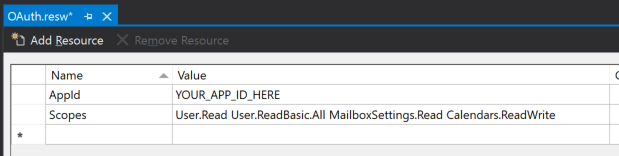

<!-- markdownlint-disable MD002 MD041 -->

<span data-ttu-id="c358b-101">この演習では、Azure AD での認証をサポートするために、前の手順で作成したアプリケーションを拡張します。</span><span class="sxs-lookup"><span data-stu-id="c358b-101">In this exercise you will extend the application from the previous exercise to support authentication with Azure AD.</span></span> <span data-ttu-id="c358b-102">これは、Microsoft Graph を呼び出すために必要な OAuth アクセストークンを取得するために必要です。</span><span class="sxs-lookup"><span data-stu-id="c358b-102">This is required to obtain the necessary OAuth access token to call the Microsoft Graph.</span></span> <span data-ttu-id="c358b-103">この手順では、 [Windows Graph コントロール](https://github.com/windows-toolkit/Graph-Controls)から**loginbutton**コントロールをアプリケーションに統合します。</span><span class="sxs-lookup"><span data-stu-id="c358b-103">In this step you will integrate the **LoginButton** control from the [Windows Graph Controls](https://github.com/windows-toolkit/Graph-Controls) into the application.</span></span>

1. <span data-ttu-id="c358b-104">ソリューションエクスプローラーで**Graphtutorial**プロジェクトを右クリックし、[ **Add > New Item...**.] を選択します。[**リソースファイル (. resw)**] を選択し`OAuth.resw` 、ファイルに名前を指定して、[**追加**] を選択します。</span><span class="sxs-lookup"><span data-stu-id="c358b-104">Right-click the **GraphTutorial** project in Solution Explorer and select **Add > New Item...**. Choose **Resources File (.resw)**, name the file `OAuth.resw` and select **Add**.</span></span> <span data-ttu-id="c358b-105">Visual Studio で新しいファイルが開いたら、次のように2つのリソースを作成します。</span><span class="sxs-lookup"><span data-stu-id="c358b-105">When the new file opens in Visual Studio, create two resources as follows.</span></span>

    - <span data-ttu-id="c358b-106">**名前:** `AppId`、**値:** アプリケーション登録ポータルで生成されたアプリ ID</span><span class="sxs-lookup"><span data-stu-id="c358b-106">**Name:** `AppId`, **Value:** the app ID you generated in Application Registration Portal</span></span>
    - <span data-ttu-id="c358b-107">**名前:** `Scopes`、**値:**`User.Read Calendars.Read`</span><span class="sxs-lookup"><span data-stu-id="c358b-107">**Name:** `Scopes`, **Value:** `User.Read Calendars.Read`</span></span>

    

    > [!IMPORTANT]
    > <span data-ttu-id="c358b-109">Git などのソース管理を使用している場合は、この時点で、ソース管理`OAuth.resw`からファイルを除外して、アプリ ID が誤ってリークしないようにすることをお勧めします。</span><span class="sxs-lookup"><span data-stu-id="c358b-109">If you're using source control such as git, now would be a good time to exclude the `OAuth.resw` file from source control to avoid inadvertently leaking your app ID.</span></span>

## <a name="configure-the-loginbutton-control"></a><span data-ttu-id="c358b-110">LoginButton コントロールを構成する</span><span class="sxs-lookup"><span data-stu-id="c358b-110">Configure the LoginButton control</span></span>

1. <span data-ttu-id="c358b-111">を`MainPage.xaml.cs`開き、次`using`のステートメントをファイルの先頭に追加します。</span><span class="sxs-lookup"><span data-stu-id="c358b-111">Open `MainPage.xaml.cs` and add the following `using` statement to the top of the file.</span></span>

    ```csharp
    using Microsoft.Toolkit.Graph.Providers;
    ```

1. <span data-ttu-id="c358b-112">既存のコンストラクターを次のように置き換えます。</span><span class="sxs-lookup"><span data-stu-id="c358b-112">Replace the existing constructor with the following.</span></span>

    :::code language="csharp" source="../demo/GraphTutorial/MainPage.xaml.cs" id="ConstructorSnippet":::

    <span data-ttu-id="c358b-113">このコードでは、の`OAuth.resw`設定を読み込み、その値を使用して msal プロバイダーを初期化します。</span><span class="sxs-lookup"><span data-stu-id="c358b-113">This code loads the settings from `OAuth.resw` and initializes the MSAL provider with those values.</span></span>

1. <span data-ttu-id="c358b-114">`ProviderUpdated`イベントのイベントハンドラーをに追加し`ProviderManager`ます。</span><span class="sxs-lookup"><span data-stu-id="c358b-114">Now add an event handler for the `ProviderUpdated` event on the `ProviderManager`.</span></span> <span data-ttu-id="c358b-115">次の関数を `MainPage` クラスに追加します。</span><span class="sxs-lookup"><span data-stu-id="c358b-115">Add the following function to the `MainPage` class.</span></span>

    :::code language="csharp" source="../demo/GraphTutorial/MainPage.xaml.cs" id="ProviderUpdatedSnippet":::

    <span data-ttu-id="c358b-116">このイベントは、プロバイダーが変更されたとき、またはプロバイダーの状態が変更されたときにトリガーされます。</span><span class="sxs-lookup"><span data-stu-id="c358b-116">This event triggers when the provider changes, or when the provider state changes.</span></span>

1. <span data-ttu-id="c358b-117">ソリューションエクスプローラーで、[**ホームページ] .xaml**を`HomePage.xaml.cs`展開し、を開きます。</span><span class="sxs-lookup"><span data-stu-id="c358b-117">In Solution Explorer, expand **HomePage.xaml** and open `HomePage.xaml.cs`.</span></span> <span data-ttu-id="c358b-118">既存のコンストラクターを次のように置き換えます。</span><span class="sxs-lookup"><span data-stu-id="c358b-118">Replace the existing constructor with the following.</span></span>

    :::code language="csharp" source="../demo/GraphTutorial/HomePage.xaml.cs" id="ConstructorSnippet":::

1. <span data-ttu-id="c358b-119">アプリを再起動し、アプリの上部にある [**サインイン**] コントロールをクリックします。</span><span class="sxs-lookup"><span data-stu-id="c358b-119">Restart the app and click the **Sign In** control at the top of the app.</span></span> <span data-ttu-id="c358b-120">サインインしたら、UI が変更され、サインインに成功したことを示します。</span><span class="sxs-lookup"><span data-stu-id="c358b-120">Once you've signed in, the UI should change to indicate that you've successfully signed-in.</span></span>

    

    > [!NOTE]
    > <span data-ttu-id="c358b-122">この`ButtonLogin`コントロールは、アクセストークンの格納と更新のロジックを実装します。</span><span class="sxs-lookup"><span data-stu-id="c358b-122">The `ButtonLogin` control implements the logic of storing and refreshing the access token for you.</span></span> <span data-ttu-id="c358b-123">トークンは、セキュリティで保護されたストレージに格納され、必要に応じて更新されます。</span><span class="sxs-lookup"><span data-stu-id="c358b-123">The tokens are stored in secure storage and refreshed as needed.</span></span>
